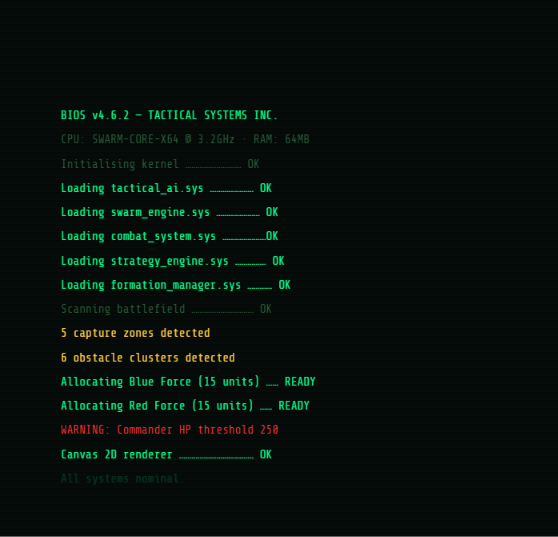
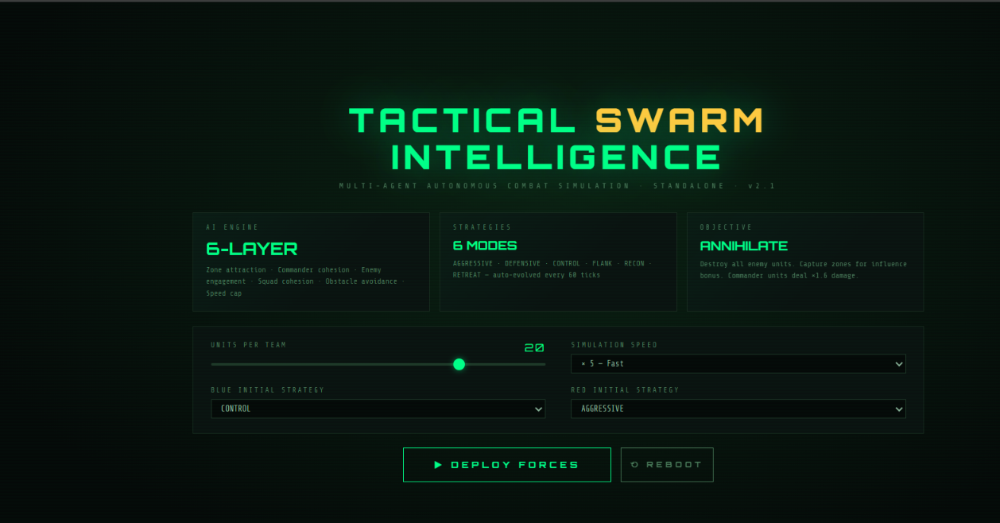
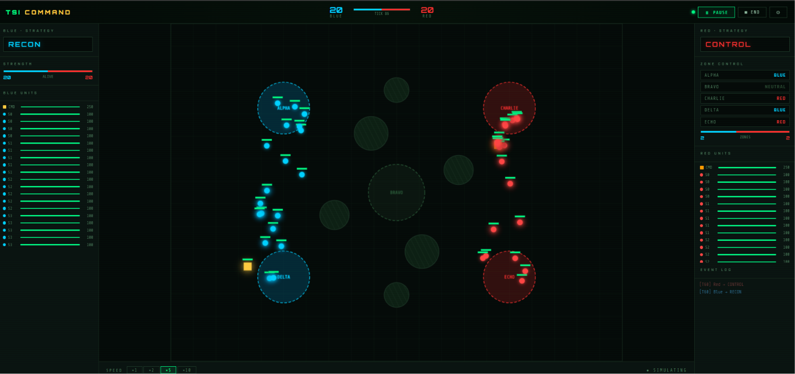
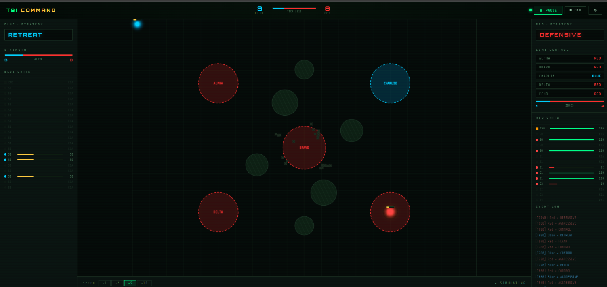
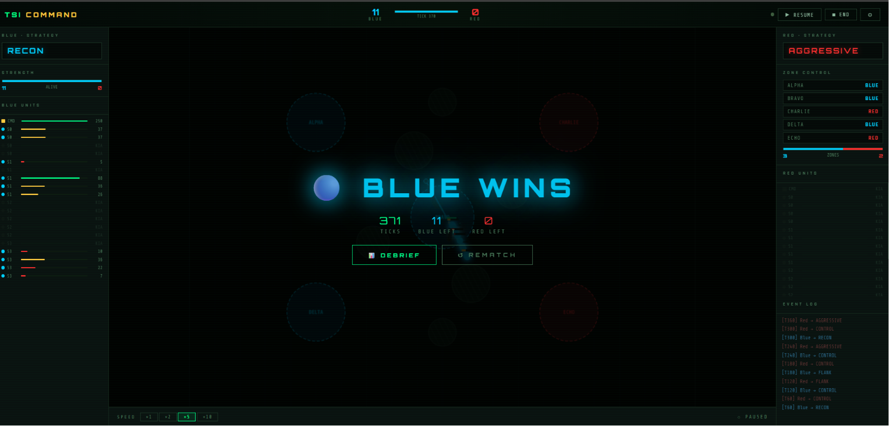
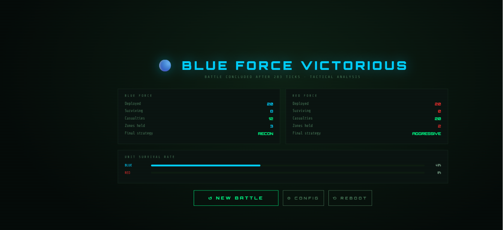

# TACTICAL SWARM INTELLIGENCE

> Real-time multi-agent battle simulation — autonomous AI units fight for zone control using swarm tactics, dynamic strategy switching, and commander-led cohesion.


---

## 📸 Screenshots

### 🖥️ Screen 1 — Boot Sequence


> Terminal-style animated boot sequence — loads all AI modules line by line, then auto-transitions to the Briefing screen.

---

### ⚙️ Screen 2 — Mission Briefing & Config


> Configure team size (5–25 units), simulation speed, and the opening strategy for both Blue and Red forces before deployment.

---

### ⚔️ Screen 3 — Live Battle (Early Game)


> Both forces at full strength — Blue (RECON) and Red (CONTROL) racing to capture zones. Agents cluster around Alpha, Delta, Charlie and Echo.

---

### 🔴 Screen 3 — Live Battle (Late Game)


> Blue force down to 3 units on RETREAT, Red holds 4 of 5 zones. Strategy auto-switched to DEFENSIVE for Red.

---

### 🏆 Screen 3 — Victory Overlay


> **BLUE WINS** — 371 ticks, 11 survivors, Red force annihilated. Debrief and Rematch buttons appear over the frozen battlefield.

---

### 📊 Screen 4 — Post-Battle Debrief


> Full statistical breakdown — deployed vs surviving units, casualties, zones held, ticks elapsed, and survival rate bars for both teams.

---

## Overview

Tactical Swarm Intelligence is a **fully standalone** multi-agent AI simulation. The HTML frontend runs the entire simulation in JavaScript — no server required. Alternatively, the Python/Flask backend exposes a REST API that the frontend can poll.

Each agent perceives its local environment and makes independent movement and attack decisions every tick, producing emergent squad-level tactics.

---

## ✨ Features

| Feature | Details |
|---|---|
| **Swarm AI** | Per-agent behavioural layers: zone attraction, commander cohesion, enemy engagement, squad cohesion, obstacle avoidance |
| **6 Strategies** | `AGGRESSIVE` `DEFENSIVE` `CONTROL` `FLANK` `RECON` `RETREAT` — auto-selected every 60 ticks |
| **Commanders** | One commander per team; nearby soldiers gain +attack and +speed influence aura |
| **Combat System** | Range-based fire; commanders deal ×1.6 damage; influenced soldiers deal ×1.1 |
| **5 Capture Zones** | Alpha · Bravo · Charlie · Delta · Echo — flip owner when more agents stand inside |
| **6 Obstacles** | Solid terrain features that all agents avoid |
| **Formation Manager** | `line`, `wedge`, `circle`, `column` formations per squad |
| **4-Screen UI** | Boot → Briefing → Battle HUD → Debrief |
| **Speed Control** | ×1 / ×2 / ×5 / ×10 simulation speed |
| **Standalone** | `index.html` runs entirely in-browser, no server needed |

---

## 📁 Project Structure

```
tactical-swarm-intelligence/
│
├── app.py                # Flask REST API entry point
├── agent.py              # Agent class (state + physics)
├── battlefield.py        # Battlefield, zones, obstacles
├── combat_system.py      # Range-based damage resolution
├── formation_manager.py  # Squad formation geometry
├── strategy_engine.py    # Macro-strategy selector
├── swarm_engine.py       # Simulation orchestrator
├── tactical_ai.py        # Per-agent behavioural update
│
├── index.html            # Standalone 4-screen frontend
├── requirements.txt      # Python dependencies
│
├── reboot.png            # Screenshot — Boot screen
├── deploy.png            # Screenshot — Briefing screen
├── processing.png        # Screenshot — Battle early game
├── defensive.png         # Screenshot — Battle late game
├── command.png           # Screenshot — Victory overlay
├── victory.png           # Screenshot — Debrief screen
│
└── README.md
```

---

## 🚀 Quick Start

### Option A — Open directly (no server needed)

```bash
open index.html        # macOS
start index.html       # Windows
xdg-open index.html    # Linux
```

### Option B — Flask backend

```bash
git clone https://github.com/ry347912-cyber/tactical-swarm-intelligence.git
cd tactical-swarm-intelligence
pip install -r requirements.txt
python app.py
# → http://localhost:5000
```

---

## 📡 API Endpoints

| Method | Endpoint | Description |
|--------|----------|-------------|
| `GET` | `/` | Serves `index.html` |
| `GET` | `/battle` | Advance simulation by one tick, return state |
| `GET` | `/state` | Return current state without advancing |
| `GET` | `/reset` | Restart the simulation from scratch |

### State Object (JSON)

```json
{
  "tick": 420,
  "blue_team": [{ "id": 0, "x": 123.4, "y": 200.1, "health": 85.2, "rank": "commander" }],
  "red_team":  [...],
  "battlefield": {
    "zones": [{ "id": 0, "x": 200, "y": 150, "owner": "blue", "label": "Alpha" }],
    "obstacles": [{ "x": 355, "y": 195, "radius": 32 }]
  },
  "attacks": [{ "x1": 120, "y1": 200, "x2": 300, "y2": 250, "team": "blue", "lethal": false }],
  "blue_strategy": "CONTROL",
  "red_strategy": "AGGRESSIVE",
  "blue_alive": 12,
  "red_alive": 9,
  "winner": null,
  "log": ["[T60] Blue → DEFENSIVE", "[T120] Red → FLANK"]
}
```

---

## 🧠 AI Architecture

### Behavioural Layers (per tick, per agent)

```
1. Zone attraction     →  move toward highest-scoring uncaptured zone
2. Commander cohesion  →  if within 180 px of commander, gain "influence"
3. Enemy engagement    →  ATTACK / FLANK / RETREAT based on strategy
4. Squad cohesion      →  stay near same-squad allies within 150 px
5. Obstacle avoidance  →  push away from terrain features
6. Speed cap           →  clamp |velocity| to max_speed
```

### Strategy Selection (every 60 ticks)

```python
if alive_ratio < 0.45       → RETREAT
if owned_zones == 0         → AGGRESSIVE
if owned_zones > enemy + 1  → DEFENSIVE
if owned_zones < enemy      → AGGRESSIVE or CONTROL
if ratio > 1.4              → AGGRESSIVE
if ratio < 0.7              → FLANK
else                        → random(FLANK, CONTROL, RECON)
```

### Combat

- Each attacker fires at the **nearest enemy within range** (82 px soldiers · 110 px commanders)
- Damage: 6–14 base; commanders ×1.6; influenced agents ×1.1
- Agents flee from enemies when `health < 40`

---

## ⚙️ Configuration

| Parameter | File | Default | Effect |
|---|---|---|---|
| Team size | `swarm_engine.py` | 15 | Units per side |
| Commander HP | `swarm_engine.py` | 250 | Commander survivability |
| Strategy interval | `swarm_engine.py` | 60 ticks | Re-evaluation frequency |
| Zone radius | `battlefield.py` | 45–50 px | Capture point size |
| Agent speed | `agent.py` | 2.5 | Base movement speed |
| Attack range | `agent.py` | 82 px | Soldier firing range |
| Commander range | `swarm_engine.py` | 110 px | Commander firing range |

---

## 🔧 Extending

**New strategy** — add to `STRATEGIES` in `strategy_engine.py`, conditions to `determine_strategy()`, then handle the tag in `tactical_ai.py`.

**More teams** — modify `_create_teams()` in `swarm_engine.py`; the AI and combat system handle arbitrary agent counts.

**LLM commander** — wrap `determine_strategy()` to call an external API and return a strategy string.

---

## 📋 Requirements

- **Standalone:** Any modern browser (Chrome · Firefox · Edge · Safari)
- **Flask backend:** Python 3.10+, `flask>=3.0.0`, `flask-cors>=4.0.0`

---

## 👨‍💻 Author

**Rupesh Yadav**  
B.Tech Computer Science Engineer  
Cybersecurity & AI Enthusiast

---

## 📄 License

MIT — see `LICENSE` for details.

---

*Built with Python · Flask · HTML5 Canvas*
